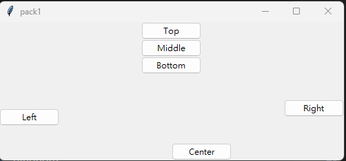

## window_layout 按鈕建置 筆記
```
class Window(tk.Tk):
    def __init__(self,**kwargs):
        super().__init__(**kwargs)
        self.title("pack1")
        #按鈕1
        btn1:ttk.Button=ttk.Button(self,text="Top")
        btn1.pack()
        #按鈕2
        btn2:ttk.Button=ttk.Button(self,text="Middle")
        btn2.pack()
        #按鈕3
        btn3:ttk.Button=ttk.Button(self,text="Bottom")
        btn3.pack()
        
        # #只產生一次 後續操控無法作用
        # ttk.Button(self,text="Top").pack()
        # ttk.Button(self,text="Middle").pack()
        # ttk.Button(self,text="Bottom").pack()

        #視窗的設定
        self.geometry("300x200")

        #左右填滿
        ttk.Button(self,text="Left").pack(fill="x")  
        ttk.Button(self,text="This is the Center Button").pack(fill="x")  
        ttk.Button(self,text="Right").pack(fill="x")

        #左右填滿+延展 會做平均分配
        ttk.Button(self,text="Top").pack(fill="both",expand=1)  
        ttk.Button(self,text="Middle").pack(fill="both",expand=1)  
        ttk.Button(self,text="Bottom").pack(fill="both",expand=1)

if __name__ == "__main__":
    window:Window=Window()
    window.mainloop()
```
